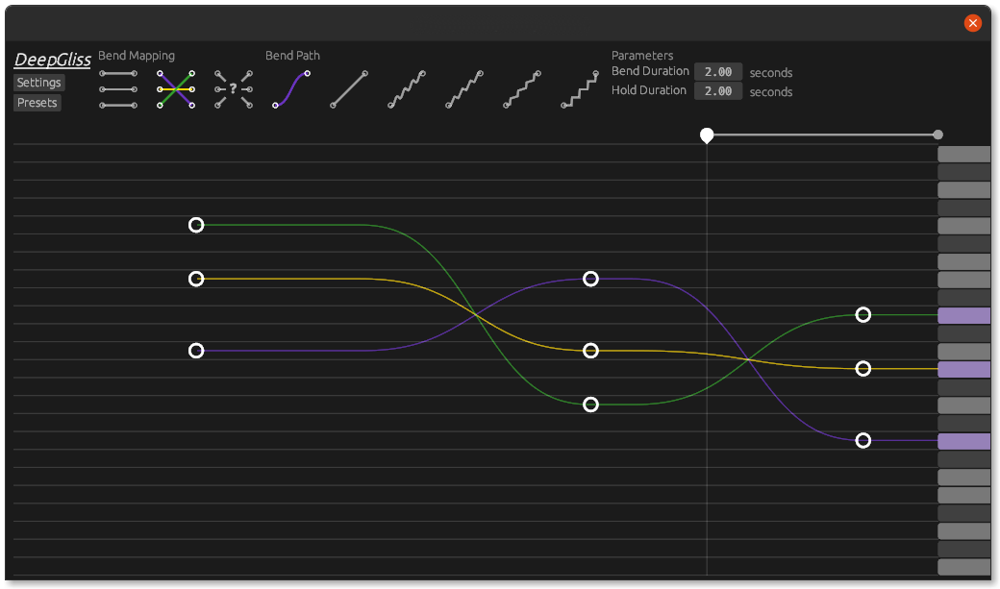

<h1 align="center"><i>DeepGliss</i></h1>

VST2 plugin performing continuous pitch bend between chords.

## About

The inspiration for this project came when trying to recreate [Deep Note](https://en.wikipedia.org/wiki/Deep_Note).

The name DeepGliss comes from [Deep Note](https://en.wikipedia.org/wiki/Deep_Note) + [Glissando](https://en.wikipedia.org/wiki/Glissando).
